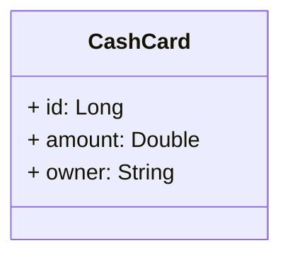

# Family Cash Card service

# Sobre o projeto
Esse projeto foi desenvolvido durante o curso introdutório denominado "Construindo uma API REST com Spring Boot" disponibilizado pela Spring Academy. O objetivo do projeto é criar uma API REST na qual famílias podem gerenciar mesadas na forma de cartões de débito digitais.

A API possui um único recurso denominada CashCard que representa o cartão gerenciado pelas famílias. Ao longo do projeto tive a oportunidade de ter o contato com técnicas de desenvolvimento de software como o TDD (Test Driven Development), definição de contrato de uma API, criação de endpoints para manipulação do CashCard, aplicação de segurança na API utilizando o Spring Security.

Ao final do projeto desenvolvi um CRUD completo relacionado ao recurso CashCard com a implementação de paginação e ordenação.

# Modelo conceitual 


# Tecnologias utilizadas 
- Java 21
- Gradle
- Spring Boot
- Spring Web
- Spring Data JPA
- Spring Security
- Spring Validation

# Como executar o projeto
**Pré-requisitos: Java 21, Git**

```bash

# realize o clone do projeto
git clone https://github.com/matheus-fvp13/java-spring-cashcard.git

# abrir o diretorio do projeto
cd java-spring-cashcard

# executar os testes
./gradlew test

# executar o projeto
./gradlew bootRun

```

# Autor
Matheus Fernando Vieira Pinto

https://www.linkedin.com/in/matheus-fvp/
